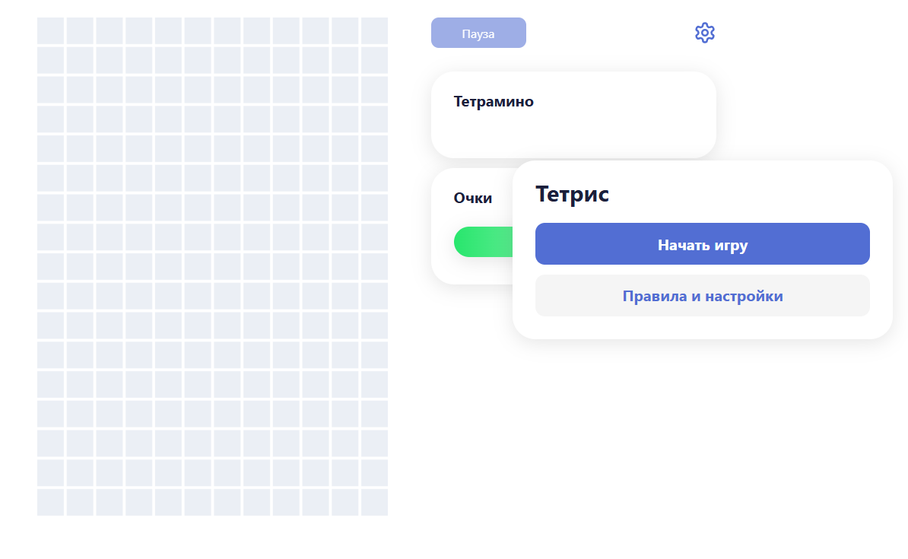

# Тетрис

## О реализованном

Игра в тетрис имеет ряд преимуществ. Она понятная и простая в реализации.
На данный момент реализовано:

- Простой подсчет очков
- Возможность игры с клавиатуры или мышки
- Падение, ускорение, поворот и дроп фигуры
- Настройки изменения размера поля
- Небольшая анимация падающих тетрамино

## Стек

В качестве UI была использована Taiga. Фреймворк - Angular. Игра реализована на Canvas.

## Превью
#### Начало игры:

#### Падающие тетрамино:

#### Процесс игры:

#### Конец игры:

